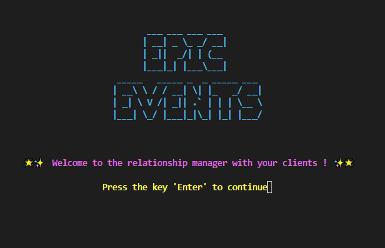
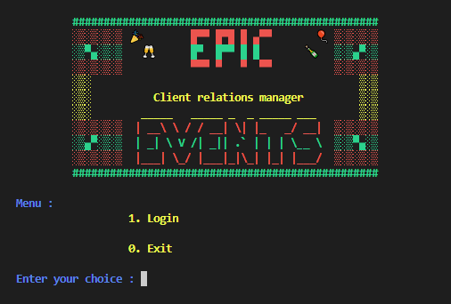
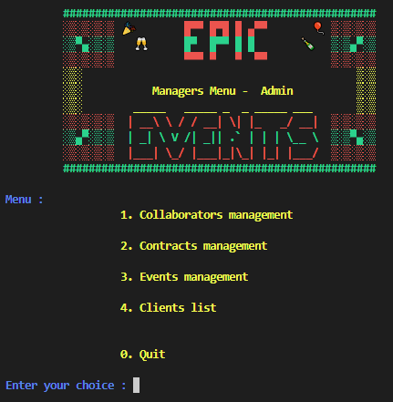
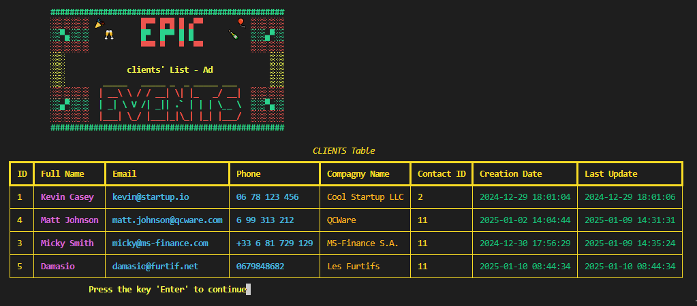
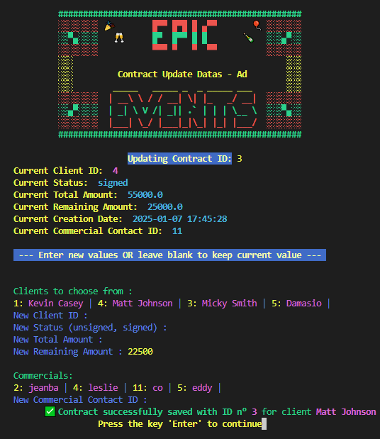
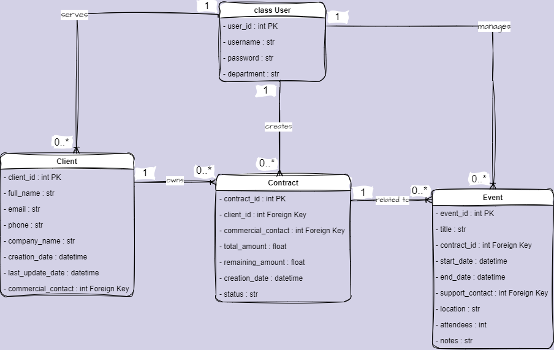

# <p align="center"><bold>Epic Events CRM - OCR_Mission[11]</bold></p>

<p align="center">=========================================================================</p>
<p align="center">
    <br/>
    <div style="display: flex; gap: 10px;"> 
        
        
        
    </div>
    <p align="center">
        
        
    </p>
    <br/>
    <br/>
</p>

### <p align="center">- Epic Events CRM Software -</p>

# <p align="center"> I. Project Description</p>

This CRM (Customer Relationship Management) software is designed to manage clients, contracts, and events efficiently. It provides a comprehensive solution for managing commercial activities, including client creation, contract management, and event planning. The software is built using Python and SQLAlchemy for database interactions, ensuring a robust and scalable architecture.

# <p align="center"> II. Main Functionalities</p>

### User Authentication

-   **Login**: Users can log in with their credentials.
-   **Role-Based Access**: Different roles (MANAGEMENT, COMMERCIAL, SUPPORT) have access to specific functionalities.

### Client Management

-   **Create Client**: Commercial users can create new clients with details such as full name, email, phone number, and company name.
-   **Update Client**: Existing client information can be updated.
-   **List Clients**: View a list of all clients.

### Contract Management

-   **Create Contract**: Managers can create new contracts with details such as client ID, commercial contact ID, total amount, remaining amount, and status.
-   **Update Contract**: Existing contracts can be updated.
-   **Filter Contracts**: View unsigned or signed contracts.
-   **List Contracts**: View a list of all contracts.

### Event Management

-   **Create Event**: Commercial users can create events for signed contracts with details such as title, start date, end date, location, attendees, and notes.
-   **Update Event**: Existing events can be updated.
-   **Assign Support**: Managers can assign support contacts to events.
-   **List Events**: View a list of all events.

### Collaborator Management

-   **Create Collaborator**: Managers can create new collaborators with roles such as MANAGEMENT, COMMERCIAL, or SUPPORT.
-   **Update Collaborator**: Existing collaborator information can be updated.
-   **Delete Collaborator**: Collaborators can be deleted from the system.
-   **List Collaborators**: View a list of all collaborators.

# <p align="center"> III. Code Structure/Architecture</p>

The technologies used in this project are :

-   Python 3.x
-   PostgreSQL (database)
-   SQLAlchemy (ORM)
-   bcrypt (hashing & salt)

### Controllers

The `controllers` directory contains the business logic for the application. Each controller handles specific functionalities such as client management, contract management, event management, user authentication, and utility functions.

-   **main_ctrl.py**: The main controller that directs the flow based on user roles.
-   **login_ctrl.py**: Manages user authentication and login.
-   **utils_ctrl.py**: Contains utility functions, including database session management.

-   **user_ctrl.py**: Manages user-related operations.
-   **client_ctrl.py**: Handles client-related operations.
-   **contract_ctrl.py**: Manages contract-related operations.
-   **event_ctrl.py**: Handles event-related operations.

### Models

The `models` directory contains the database models defined using SQLAlchemy. These models represent the tables in the database. The 12 rounds of passwords hashing with a grain of salt are processed by the bcrypt package.

-   **models.py**: Defines the database models for users, clients, contracts, and events.

<p align="center">
  <br/>
  <picture> 
    
  </picture>
  <br/>
  <br/>
</p>

### Validator

The `validator` directory contains input validation functions to ensure that user inputs are correct and valid.

-   **inputs.py**: Contains functions for validating various types of inputs such as integers, strings, emails, dates, and more.

### Views

The `views` directory contains the presentation logic for the application. Each view handles the display of information and user interactions.

-   **view.py**: Contains utility functions for displaying information, such as printing tables and menus.
-   **main_view.py**: Manages the display of the main menu and role-specific menus.
-   **login_view.py**: Handles the display of the login screen.
-   **error_view.py**: Handles the display of error messages.

-   **user_view.py**: Handles the display of user-related information.
-   **client_view.py**: Handles the display of client-related information.
-   **contract_view.py**: Manages the display of contract-related information.
-   **event_view.py**: Manages the display of event-related information.

### Main

The `main.py` file is the entry point of the application. It initializes the application and starts the login process.

### Environment Configuration

The little script `init_config.py` will guide you through environment variable setting, database tables creation and creation of your first admin/manager user.
The `.env` file contains environment variables for configuring the database connection.

---

## <p align="center">I - Setup windows</p>

#### ( if [Git](https://github.com/git-for-windows/git/releases/download/v2.45.0.windows.1/Git-2.45.0-64-bit.exe), [python 3.6+](https://www.python.org/ftp/python/3.12.3/python-3.12.3-amd64.exe) and [postgreSQL](https://www.enterprisedb.com/downloads/postgres-postgresql-downloads) are not installed, start with appendix 1 !)

---

#### A - Create a directory for the program

Launch your Windows explorer (WIN+E)
Create a folder (CTRL+MAJ+N) for the program wherever you want and ** name it **
ex. : You can call it ** EpicEvents ** in D: \way\Towards\my\Software\EpicEvents
** Double-click ** on the folder created to go inside.

#### B - Launch the Windows Terminal

Left click in the address bar of the explorer, write ** "cmd" ** (instead of the address)
And press ** "enter" ** (as with each inline future instruction):

    cmd

#### C - Clone the GitHub repo of the project in this folder

In the terminal (the command prompt) indicating that you are at the address of the file created, write in turn:

    git init

then :

    git pull https://github.com/AdeVedA/EpicEventsCRM--OCR_Mission11 -t main

#### D - Install a virtual environment in a 'env' folder in the project folder, always through the command prompt :

    python -m venv env

#### E - Activate the virtual environment previously created :

    env\Scripts\activate.bat

#### F - Install the required libraries :

    pip install -r requirements.txt

#### G - Setup your environment (1.), create your tables (2.) and populate with your admin manager (3.) :

    python init_config.py

#### H - Program launch (the virtual environment must always have been activated before):

    python main.py

#### I - Disable the virtual environment

    deactivate

---

---

## <p align="center">II - Setup Linux/Mac</p>

#### ( if **[Git](https://sourceforge.net/projects/git-osx-installer/files/git-2.23.0-intel-universal-mavericks.dmg/download?use_mirror=autoselect)**, **[python](https://www.python.org/ftp/python/3.12.3/python-3.12.3-macos11.pkg)** and **[postgreSQL](https://www.enterprisedb.com/downloads/postgres-postgresql-downloads)** are not installed, start with appendix 1 !)

---

#### A- launch a terminal

Click on magnifying glass/search and launch

    terminal

#### B - Create a directory for the program and place yourself in

For example if you want to call this folder "EpicEvents" :

    mkdir EpicEvents

Then :

    cd EpicEvents

#### C - Clone the GitHub repo of the project in this folder

In the terminal (the command prompt) indicating that you are at the address of the file created, write in turn:

    git init

Then :

    git pull https://github.com/AdeVedA/EpicEventsCRM--OCR_Mission11 -t main

#### D - Install a virtual environment in a 'env' folder in the project folder, always through the command prompt :

    python3 -m venv env

#### E - Activate the virtual environment previously created :

    source env/bin/activate

#### F - Install the required libraries :

    pip install -r requirements.txt

#### G - Setup your environment (1.), create your tables (2.) and populate with your admin manager (3.) :

    python3 init_config.py

#### H - Program launch (the virtual environment must always have been activated before):

    python3 main.py

#### I - Disable the virtual environment

    deactivate

## <p align="center">III - Directory Structure</p>

```bash
├── controllers/
│              ├── client_ctrl.py
│              ├── contract_ctrl.py
│              ├── event_ctrl.py
│              ├── login_ctrl.py
│              ├── main_ctrl.py
│              ├── user_ctrl.py
│              └── utils_ctrl.py
├── models/
│         └── models.py
├── validator/
│            └── inputs.py
├── views/
│        ├── client_view.py
│        ├── contract_view.py
│        ├── error_view.py
│        ├── event_view.py
│        ├── login_view.py
│        ├── main_view.py
│        ├── user_view.py
│        └── view.py
├── main.py
├── init_config.py
├── database.py
├── populate_users.py
├── README.md
├── requirements.txt
├── .env
etc...
```

# <p align="center">Appendix 1 - Python, Git and postgreSQL Installation</p>

=======================================================================

## for Windows 64bits :

install **[Git](https://github.com/git-for-windows/git/releases/download/v2.45.0.windows.1/Git-2.45.0-64-bit.exe)**
Check by typing "cmd" in the start menu then "Git version" in the terminal

install **[python](https://www.python.org/ftp/python/3.12.3/python-3.12.3-amd64.exe)** assuring you that **_"Add to PATH"_** is checked (leave the other default choices)
Check by typing "cmd" in the start menu then "python -version" in the terminal

install the latest (17.2+) version for your OS of **[postgreSQL](https://www.enterprisedb.com/downloads/postgres-postgresql-downloads)** and don't forget your database informations (name, password etc) you'll need them launching init_config.py

## for Mac/Linux :

**Git**
Click on the search icon (magnifying glass), write "terminal" (we check if git is already present)

    git version

If ok, go installing Python.
Otherwise, install what it offers to install ("Command Line Developer Tools") then try again "git version" in terminal,
Otherwise: install **[Git](https://sourceforge.net/projects/git-osx-installer/files/git-2.23.0-intel-universal-mavericks.dmg/download?use_mirror=autoselect)**
Then verify again "git version" in the terminal

**Python**
install **[python](https://www.python.org/ftp/python/3.12.3/python-3.12.3-macos11.pkg)**

**postgreSQL**
install the latest (17.2+) version for your OS of **[postgreSQL](https://www.enterprisedb.com/downloads/postgres-postgresql-downloads)** and don't forget your database informations (name, password etc) you'll need them launching init_config.py
